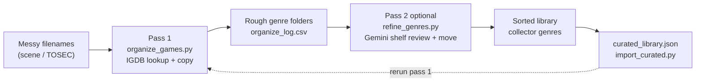
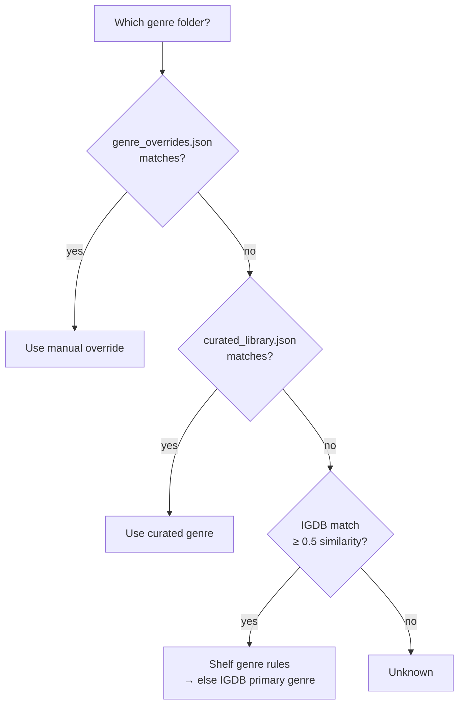
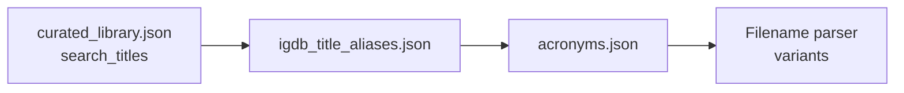

# GameOrganizer

Organize retro game files into genre folders using [IGDB](https://www.igdb.com/) metadata, then optionally refine shelves with [Gemini](https://ai.google.dev/).

Point the tool at a folder of messy scene-release or TOSEC-style filenames. **Pass 1** parses each name, looks the game up on IGDB, and **copies** files into genre subfolders. **Pass 2** (optional) asks Gemini to review shelf placement, create collector-friendly genre folders, and **move** files into the layout you want.

Built for large real-world collections (messy scene-release and TOSEC-style filenames across retro platforms), with layered heuristics and JSON files you can extend without touching code. Shipped defaults target Commodore Amiga (`.adf`), but the pipeline is platform-agnostic.

**Design goal:** IGDB is used to *identify* games where possible, but **your shelf layout** comes from a curated library, shelf rules, and (optionally) a one-time Gemini review — not raw IGDB primary genres alone. That avoids cases like *Another World* landing in RPG because IGDB fuzzy-matched the wrong title, or *Bard's Tale* going to RPG when you want a **Dungeon Crawlers** folder.

## Architecture

GameOrganizer is a **two-pass pipeline**: pass 1 uses IGDB to identify games and copy them into rough genre folders; pass 2 (optional) uses Gemini to refine shelf placement for collector-style layouts. A reviewed `curated_library.json` makes future pass 1 runs match your shelves without re-querying an LLM.



Pass 1 and pass 2 are **separate commands**. Running `organize_games.py` alone never calls Gemini.

### Hierarchy of truth

When pass 1 picks a **genre folder**, the first matching source wins:



| Priority | Source | Role |
|----------|--------|------|
| 1 | `genre_overrides.json` | Manual per-file or per-title genre — always wins |
| 2 | `curated_library.json` | Human-reviewed shelf from a prior sort or pass 2 export |
| 3 | Built-in **shelf genre rules** | Collector-friendly renames (e.g. *Dungeon Master* → Dungeon Crawlers) applied to IGDB's genre |
| 4 | IGDB primary genre | Default when a match is accepted (≥ 0.5 similarity) |
| 5 | `Unknown` | No acceptable IGDB match |

Pass 2 does not change this chart — it **moves files on disk** into better folders. Export the result with `--update-curated` or `import_curated.py` so pass 1 inherits your layout via `curated_library.json`.

When pass 1 builds **IGDB search titles** (before genre resolution), candidates are tried in order:



| Priority | Source | Role |
|----------|--------|------|
| 1 | `curated_library.json` `search_titles` | Reviewed IGDB query hints for that file |
| 2 | `igdb_title_aliases.json` | Local parsed title → IGDB canonical name |
| 3 | `acronyms.json` | Short scene names → full titles (via filename parser) |
| 4 | Filename parser | Parsed title, glued-name splits, sequel variants |

Built-in defaults ship for aliases and acronyms when local JSON files are absent. Copy the `.example` files to customize.

### Pass 1 pipeline

For each file matching the glob:

1. **Parse** the filename stem into a clean title (`filename_parser.py`)
2. **Build search candidates** — curated hints, acronyms, aliases, glued-name expansions, sequel variants
3. **Look up** the best IGDB match (`igdb_client.py`); results below **0.5** similarity are rejected (see [IGDB match threshold](#igdb-match-threshold))
4. **Resolve genre** using the [hierarchy of truth](#hierarchy-of-truth) above
5. **Copy** the file to `{dest}/{genre}/{filename}` (originals are never moved or deleted)

**Pass 2** walks the organized tree folder-by-folder, sends batches to Gemini (`gemini_client.py`) with filename + parsed title + IGDB context from `organize_log.csv`, caches each decision, and moves files unless `--dry-run` is set.

Sequel numbers and disk labels are stripped where possible. Expansion disks and DLC often inherit genre from the base game (e.g. *Test Drive II - California Challenge* → *Test Drive II*).

## Features

- **Recursive glob scan** — e.g. `E:\Games\**\*.adf`
- **Filename cleanup** — strips TOSEC/scene tags, disk suffixes (`-d1`, `Disk1`, `Ultima5a`), hardware tags, and more
- **Heuristic title parsing** — splits glued names (`doubledragon2`), expands abbreviations (`abreed` → Alien Breed), roman numeral variants (`Populous II`)
- **IGDB lookup** — OAuth via Twitch, on-disk cache, rate limiting, fuzzy match scoring
- **Amiga-aware defaults** — `.adf` maps to Commodore Amiga via `platform_defaults.json` (editable; many other extensions included)
- **Curated library** — ship (or import) human-reviewed filename → genre mappings so reruns match your shelves
- **Shelf genre rules** — collector-friendly categories (Dungeon Crawlers, Rogue-Likes, etc.) applied on top of IGDB
- **Stricter IGDB matching** — rejects false positives like *Another World* → *Might and Magic II*
- **Gemini pass 2** — batch review by current genre folder; auto-retries on rate limits; auto-selects an available model for your API key
- **Dry run** — pass 1: use `--dry-run` to preview; pass 2: omit `--dry-run` to move files (use `--dry-run` to preview)
- **CSV logs** — `organize_log.csv` (pass 1) and `refine_log.csv` (pass 2)

## Requirements

- Python 3.10+
- A free [Twitch developer application](https://dev.twitch.tv/console/apps) (category: **Application Integration**) for IGDB API access — **pass 1**
- A [Gemini API key](https://aistudio.google.com/apikey) — **pass 2** (optional but recommended for collector-style shelves)

```bash
pip install -r requirements.txt
```

## Quick start (two-pass, recommended)

**Note: Pass 1 will exit immediately if `.env` is missing or IGDB credentials are blank.** Copy `.env.example` to `.env` and fill in your keys before running any commands.

1. Clone the repo and install dependencies.
2. Copy `.env.example` to `.env` and add IGDB + Gemini credentials.
3. **Pass 1** — dry run first:

```powershell
python organize_games.py --source "E:\Amiga_Stuff\*.adf" --dest "E:\Amiga_Stuff\Amiga ADF by Genre" --dry-run
```

4. **Pass 1** — copy files when satisfied:

```powershell
python organize_games.py --source "E:\Amiga_Stuff\*.adf" --dest "E:\Amiga_Stuff\Amiga ADF by Genre"
```

5. **Pass 2** — dry run (review proposed moves):

```powershell
python refine_genres.py --dest "E:\Amiga_Stuff\Amiga ADF by Genre" --dry-run
```

6. **Pass 2** — move files:

```powershell
python refine_genres.py --dest "E:\Amiga_Stuff\Amiga ADF by Genre"
```

**Important:** `--source` must include a glob in the filename part (e.g. `*.adf`). There is no default extension.

## Starting fresh (ignore prior run decisions)

To rerun without cached lookups or prior shelf decisions, delete these files (keep acronyms/aliases unless you want a totally clean parser):

| Delete | Why |
|--------|-----|
| `igdb_genre_cache.json` | Stale IGDB search results |
| `curated_library.json` | Prior reviewed shelf assignments |
| `genre_overrides.json` | Manual genre overrides |
| `ai_genre_cache.json` | Prior Gemini decisions |
| `organize_log.csv` | Optional; pass 2 uses it for context |
| `refine_log.csv` | Output only; safe to delete |

Keep `acronyms.json`, `igdb_title_aliases.json`, and `.env` unless you want to drop your parsing fixes too. `.igdb_token_cache.json` is only an OAuth token (not a genre decision).

## Credentials

All API keys live in a **`.env`** file beside the scripts. Never commit it.

```bash
cp .env.example .env
```

Edit `.env`:

```
IGDB_CLIENT_ID=your_twitch_client_id
IGDB_CLIENT_SECRET=your_twitch_client_secret
GEMINI_API_KEY=your_gemini_api_key
```

- **IGDB** (pass 1): create a free [Twitch developer application](https://dev.twitch.tv/console/apps) (category: **Application Integration**).
- **Gemini** (pass 2): get a key from [Google AI Studio](https://aistudio.google.com/apikey).

`GEMINI_MODEL` is optional — defaults to `gemini-2.5-flash` with auto-fallback if unavailable.

## Pass 2 troubleshooting

| Error | Meaning | Fix |
|-------|---------|-----|
| HTTP 404 on model | Model name not available for your key | Run `--list-models`; tool auto-fallbacks in most cases |
| HTTP 429 | Rate limit | Retries automatically; lower `--rpm` (see [Pass 2 tuning](#pass-2-tuning)) |
| Crashes mid-run | Partial progress lost | Re-run same command; `ai_genre_cache.json` resumes completed batches |

```powershell
python refine_genres.py --list-models
```

## Usage examples

### Organize Amiga ADFs

```powershell
python organize_games.py `
  --source "E:\Amiga_Stuff\Amiga ADF Files A-Z\*.adf" `
  --dest "E:\Amiga_Stuff\Amiga ADF by Genre"
```

### Dry run — show everything

```powershell
python organize_games.py --source "D:\Games\*.adf" --dest "D:\Organized" --dry-run
```

### Dry run — unknowns only

Useful when tuning mappings: prints only unmatched files and a deduplicated list of parsed titles at the end.

```powershell
python organize_games.py --source "D:\Games\*.adf" --dest "D:\Organized" --unknowns-only
```

### Pass 2 — refine shelves with Gemini

Dry run:

```powershell
python refine_genres.py --dest "E:\Amiga_Stuff\Amiga ADF by Genre" --dry-run
```

Move files (omit `--dry-run`):

```powershell
python refine_genres.py --dest "E:\Amiga_Stuff\Amiga ADF by Genre"
```

Re-query Gemini (ignore cached decisions):

```powershell
python refine_genres.py --dest "E:\Amiga_Stuff\Amiga ADF by Genre" --refresh --dry-run
```

### Other file types

`platform_defaults.json` maps extensions to IGDB platforms when `--platform` is omitted (e.g. `.adf` → Amiga, `.nes` → NES). Ambiguous extensions like `.zip` and `.iso` are unmapped — set `--platform` explicitly:

```powershell
python organize_games.py --source "D:\ROMs\*.zip" --dest "D:\Organized" --platform dos
python organize_games.py --source "D:\ROMs\*.iso" --dest "D:\Organized" --platform none
```

## Command-line options

Most flags exist for **scripting or edge cases**. For a normal run you only need `--source` + `--dest` (pass 1) or `--dest` (pass 2). Put credentials in `.env`.

### organize_games.py (pass 1)

| Option | Description |
|--------|-------------|
| `--source` | **Required.** Directory + glob, searched recursively (e.g. `D:\Games\*.adf`) |
| `--dest` | **Required.** Output directory; genre subfolders are created inside it |
| `--dry-run` | Print what would happen; do not copy files |
| `--unknowns-only` | Implies `--dry-run`; only print unmatched files + unique-title summary |
| `--platform` | IGDB platform alias (`amiga`, `snes`, `nes`, …), `none`, or numeric ID (default: from `platform_defaults.json` by extension) |

Pass 1 auto-loads **`curated_library.json`** beside the script when present. It always writes **`organize_log.csv`** and **`igdb_genre_cache.json`** in the current working directory.

### refine_genres.py (pass 2)

| Option | Description |
|--------|-------------|
| `--dest` | **Required.** Organized tree from pass 1 |
| `--dry-run` | Print proposed moves only; do not move files |
| `--update-curated` | After moving files, regenerate `curated_library.json` |
| `--refresh` | Ignore `ai_genre_cache.json` and re-query Gemini |
| `--model` | Gemini model (default: `gemini-2.5-flash`; auto-fallback if unavailable) |
| `--list-models` | Print models available to your API key and exit |
| `--batch-size` | Files per Gemini request within one genre folder (default: 25; lower if responses fail) |
| `--rpm` | Max Gemini requests per minute (default: 10; lower on free tier if you hit 429) |

Pass 2 reads **`organize_log.csv`** from the current working directory when present (pass 1 context for Gemini). It always writes **`refine_log.csv`** and **`ai_genre_cache.json`** there too.

### import_curated.py

| Option | Description |
|--------|-------------|
| `--from` | **Required.** Sorted destination root (genre subfolders) |
| `--merge` | Merge with existing `curated_library.json` instead of replacing |

Writes **`curated_library.json`** beside the scripts. Reads **`organize_log.csv`** from the current working directory when present (for IGDB search titles).

### Flag summary

| Flag | Verdict | Why it exists |
|------|---------|---------------|
| `--source`, `--dest` | **Essential** | Define input and output |
| `--dry-run` (either pass) | **Useful** | Preview without copying or moving |
| `--unknowns-only` (pass 1) | **Useful** | Filters pass 1 output while tuning |
| Credentials | **`.env` only** | No CLI flags or `igdb_credentials.json` |
| `--update-curated` | **Convenience** | Same as `import_curated.py` after pass 2 |
| `--refresh` | **Useful** | Re-query Gemini without deleting `ai_genre_cache.json` |
| `--model`, `GEMINI_MODEL` | **Optional** | Auto-fallback picks a working model |
| `--list-models` | **Diagnostic** | Not needed for normal runs |
| `--rpm`, `--batch-size` | **Tuning** | Rate limits and large-folder timeouts (see [Pass 2 tuning](#pass-2-tuning)) |
| `--platform` | **Edge case** | `.zip`, `.iso`, etc. when extension is unmapped |

Typical runs:

```powershell
python organize_games.py --source "...\*.adf" --dest "...\Organized"
python refine_genres.py --dest "...\Organized" --dry-run   # preview first
```

`import_curated.py` and `--update-curated` produce the same curated library. `--refresh` is equivalent to deleting `ai_genre_cache.json`. Logs and API caches use fixed filenames in the working directory.

## Configuration files

All JSON config files must be **valid JSON**. Every entry needs a comma except the last. If `acronyms.json` is malformed, the tool prints a warning and falls back to built-in acronyms only.

Copy the `.example` files, edit your copies, and keep secrets/overrides out of git (see `.gitignore`).

### `platform_defaults.json` — extension → IGDB platform

Used when `--platform` is not passed. Maps file extensions to IGDB platform IDs or aliases (e.g. `.adf` → `amiga` → ID 16). Extensions set to `null` (`.zip`, `.iso`, …) have no default — use `--platform` for those.

Edit this file to add or change mappings. Aliases like `amiga`, `snes`, and `genesis` are defined in the `aliases` section.

### `curated_library.json` — reviewed shelf assignments (recommended)

The most effective way to reduce manual work. Each entry maps a filename (or stem) to the **genre folder you want** and optional IGDB search titles:

```json
{
  "entries": {
    "gianasisters.adf": {
      "genre": "Platform",
      "parsed_title": "gianasisters",
      "search_titles": ["The Great Giana Sisters"]
    },
    "another world_1.adf": {
      "genre": "Platform",
      "search_titles": ["Another World"]
    }
  }
}
```

Loaded automatically if present beside the scripts (create via import or pass 2 export). Gitignored — not shipped in the repo.

**Import your own sorted folder** (after you've corrected genres once):

```powershell
python import_curated.py --from "E:\Amiga_Stuff\Amiga ADF by Genre"
```

Use `--merge` to append without overwriting existing entries.

### `acronyms.json` — scene filename → full title

For short scene-release names. Keys are matched after removing disk/sequel suffixes.

```json
{
  "eotb": "Eye of the Beholder",
  "synd": "Syndicate",
  "f1manag": "F1 Manager",
  "chasehq": "Chase H.Q."
}
```

`EOTB2-d1.ADF` → searches *Eye of the Beholder II*. `F1manag1.adf` → *F1 Manager*.

Reloaded automatically on each run. See `acronyms.json.example`. Legacy `amiga_acronyms.json` is still read if `acronyms.json` is absent.

### `igdb_title_aliases.json` — local title → IGDB canonical name

When IGDB uses a different name than your files (European re-releases, punctuation, etc.):

```json
{
  "4d sports driving": "Stunts",
  "f-15 eagle strike": "F-15 Strike Eagle II",
  "dragon force": "D.R.A.G.O.N. Force",
  "chase hq": "Chase H.Q."
}
```

Use this for **full parsed titles**, not short acronyms. Aliases are tried first in the IGDB search list. Copy `igdb_title_aliases.json.example` to `igdb_title_aliases.json` to customize; built-in defaults apply when the file is absent.

### IGDB match threshold

Pass 1 accepts an IGDB hit only when fuzzy title similarity is **≥ 0.5**. That value is hardcoded as `MIN_MATCH_SCORE` in `igdb_client.py` — there is no CLI flag.

If good games land in `Unknown`, fix the **search title** (acronyms, aliases, curated `search_titles`) rather than lowering the threshold. A lower bar tends to produce false positives (wrong game, wrong genre). To change the cutoff itself, edit `MIN_MATCH_SCORE` in source.

### `genre_overrides.json` — manual genre assignment

When IGDB has no entry, wrong genre, or you want a custom folder name:

```json
{
  "hack.adf": "Role-playing (RPG)",
  "empty disk for saves.adf": "Utility",
  "dungeonquest": "Role-playing (RPG)"
}
```

Keys match **filename**, **filename stem**, or **parsed title** (case-insensitive). Manual genres override IGDB. Loaded automatically from `genre_overrides.json` beside the script if present.

See `genre_overrides.json.example`.

## Tuning workflow

### Pass 1 tuning

1. Run `--unknowns-only` to see what's left.
2. Fix remaining gaps:
   - **IGDB name mismatch** → `igdb_title_aliases.json`
   - **Short scene name** → `acronyms.json`
   - **Wrong shelf** → `genre_overrides.json` or curated library
3. Delete `igdb_genre_cache.json` after parser/alias changes.

Genre-only and curated-library changes do **not** require clearing the IGDB cache.

### Pass 2 tuning

1. Dry-run pass 2 and review `refine_log.csv`.
2. If decisions are wrong, use `--refresh` to re-query Gemini (or delete `ai_genre_cache.json`).
3. After a good pass 2 run, future pass 1 runs inherit the refined layout via `curated_library.json` (use `--update-curated` to export it).

**`--rpm`** — max Gemini requests per minute (default **10**). Lower on the free tier if you see HTTP 429 (e.g. `--rpm 5`). Pass 2 also retries automatically on 429.

| Situation | What to do |
|-----------|------------|
| Free Gemini tier hitting 429 | `--rpm 5` or `--rpm 3` |
| Paid tier, no rate problems | Omit `--rpm` |
| Timeouts or truncated JSON | Lower `--batch-size` (default 25; try 10) |

`--batch-size` is files **per Gemini request** within one genre folder. `--rpm` is requests **per minute** — they solve different problems.

```powershell
python refine_genres.py --dest "E:\Organized" --dry-run --rpm 5 --batch-size 15
```

### Manual alternative to pass 2

Sort folders by hand once, then:

```powershell
python import_curated.py --from "E:\Amiga_Stuff\Amiga ADF by Genre"
```

### Is IGDB failing us?

Partially. IGDB is good for well-known titles but weak for:

- Scene-release filenames (`gianasisters.adf`)
- European rebrands (*4D Sports Driving* vs *Stunts*)
- Missing or wrong platform tags
- **Primary genre ≠ how collectors shelve games** (RPG vs Dungeon Crawlers)

The curated library + shelf rules address the last mile. **Pass 2 (Gemini)** handles collector-style genres (Dungeon Crawlers, Rogue-Likes, etc.) in bulk; your reviewed `curated_library.json` afterward is more reliable for reruns than re-querying an LLM every time.

## Caching

| File | Purpose | Clear when |
|------|---------|------------|
| `igdb_genre_cache.json` | IGDB search results between pass 1 runs | Parser, acronym, or alias changes |
| `.igdb_token_cache.json` | Twitch OAuth token | Rarely; re-auths automatically |
| `organize_log.csv` | Pass 1 per-file log; pass 2 context | Starting a clean pass 2 context |
| `ai_genre_cache.json` | Gemini shelf decisions between pass 2 runs | Prompt/model change, or use `--refresh` |
| `refine_log.csv` | Pass 2 move log (output only) | Anytime |

Pass 2 **resumes** from `ai_genre_cache.json` if interrupted — re-run the same command.

## Development

Run tests:

```bash
python -m unittest discover -s tests -v
```

### Project layout

```
GameOrganizer/
├── organize_games.py       # Pass 1: IGDB organize
├── refine_genres.py        # Pass 2: Gemini shelf refinement
├── import_curated.py       # Build curated_library.json from sorted folders
├── gemini_client.py        # Gemini API + cache
├── filename_parser.py        # Filename → title heuristics
├── igdb_client.py            # IGDB API client, cache, fuzzy match
├── curated.py                # Curated library + shelf genre rules
├── platform_defaults.json    # Extension -> IGDB platform defaults
├── acronyms.json.example     # Copy to acronyms.json (gitignored)
├── igdb_title_aliases.json.example
├── genre_overrides.json.example
├── requirements.txt
└── tests/
```

User-local files (gitignored, create from `.example` where noted): `acronyms.json`, `igdb_title_aliases.json`, `genre_overrides.json`, `curated_library.json`, `.env`, caches, and CSV logs.

## Limitations

- Pass 1 uses IGDB's **primary genre** when no curated/override/shelf rule applies.
- Pass 1 **copies** files; pass 2 **moves** them. Duplicates get `(2)`, `(3)`, etc. suffixes if the destination name already exists.
- IGDB coverage for obscure Amiga titles is incomplete; some games exist under different names or lack platform tags.
- Very short or generic filenames (`hack.adf`, `fix.adf`) may need manual overrides or pass 2 review.
- Gemini pass 2 quality depends on model and prompt; use `--dry-run` before moving files.
- Match quality depends on filename parsing; scene releases vary widely in naming conventions.

## Alpha status

This project is in **alpha**. Behavior may change between versions, and bugs or unexpected results are possible — especially with large collections, unusual filenames, or API rate limits.

If you hit a problem, please [open an issue on GitHub](https://github.com/glucero0/Game-Organizer-By-Genre-/issues). Include what command you ran, a sample filename (if relevant), and any error output.

## Disclaimer

**Back up your files before using this tool.** Pass 1 copies files and pass 2 moves them. While originals in the source folder are not deleted by pass 1, mistakes in configuration, bugs, interrupted runs, or duplicate handling could still lead to lost, misplaced, or overwritten data.

You are solely responsible for your game files. The author is **not liable** for any loss or damage arising from use of this software. Always maintain a separate backup copy before running any utility that copies, moves, or reorganizes files on disk.

## Acknowledgements

Game metadata from [IGDB](https://www.igdb.com/) (Twitch). Pass 2 powered by [Google Gemini](https://ai.google.dev/).

Written with Cursor Composer 2.5 Standard with direction by Gary Lucero.
